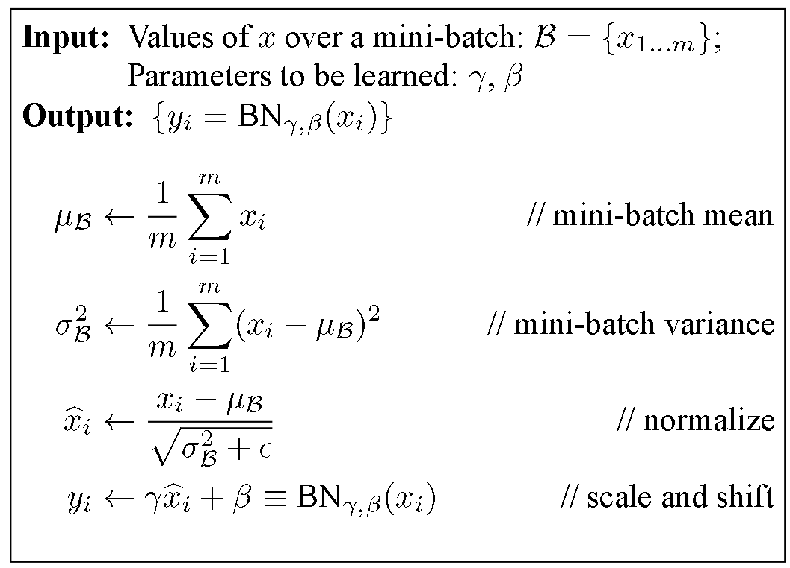
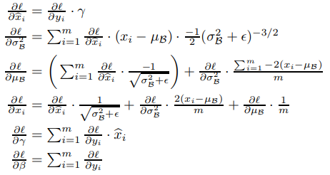

# Batch Normalization

Implementation of the Batch Normalization technique (Numpy) and
reproduction of MNIST results.

Paper:
Ioffe, Sergey, and Christian Szegedy. “Batch Normalization: Accelerating Deep 
Network Training by Reducing Internal Covariate Shift.” ArXiv:1502.03167 [Cs], Mar. 2015. arXiv.org, http://arxiv.org/abs/1502.03167.

MNIST - Dataset:
[LeCun, Y., Bottou, L., Bengio, Y., and Haffner, P. (1998).](http://dx.doi.org/10.1109/5.726791) Gradient-based 
learning applied to document recognition. Proceedings of the IEEE, 86, 2278–2324.

MNIST dataset is made available under the terms of the [Creative Commons 
Attribution-Share Alike 3.0 license](https://creativecommons.org/licenses/by-sa/3.0/).

## Definition

Batch Normalization provides stability to the inputs of the activation functions. 
By doing that, it reduces the number of steps needed to train a model. 

### Forward Pass



### Backward Pass



## Results


## Reproduce

### Requirements

```
pip install -r requirements.txt
```
### Get MNIST

```bash
cd data/
unzip mnist-in-csv.zip
```

### Run Script

```bash
python3 main.py
```
